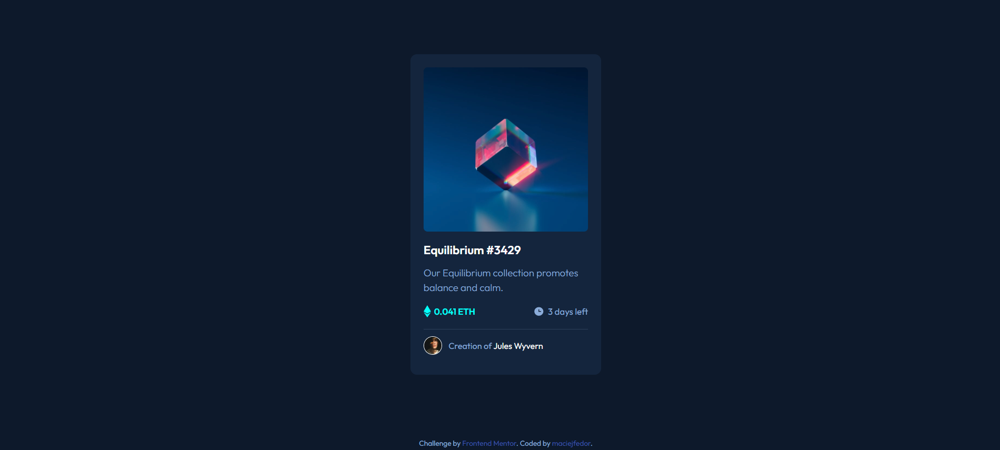

# Frontend Mentor - NFT preview card component solution

This is a solution to the [NFT preview card component challenge on Frontend Mentor](https://www.frontendmentor.io/challenges/nft-preview-card-component-SbdUL_w0U).

## Table of contents

- [Overview](#overview)
  - [Screenshot](#screenshot)
  - [Links](#links)
- [My process](#my-process)
  - [Built with](#built-with)
  - [What I learned](#what-i-learned)
- [Author](#author)

## Overview

### Screenshot

### Links

- [Solution](https://github.com/maciejfedor/frontendmentor.io/tree/master/nft-preview-card-component-main)
- [Live](https://nft-preview-card-component-maciej.netlify.app)

## My process

### Built with

- Semantic HTML5
- CSS3
- Flexbox
- CSS Grid
- Absolute positioning

### Useful resources

- [w3schools.com](https://www.w3schools.com/howto/howto_css_image_overlay.asp) - This pattern helped me with creating an image overlay effect on hover

## Author

- Frontend Mentor - [@maciejfedor](https://www.frontendmentor.io/profile/maciejfedor)
