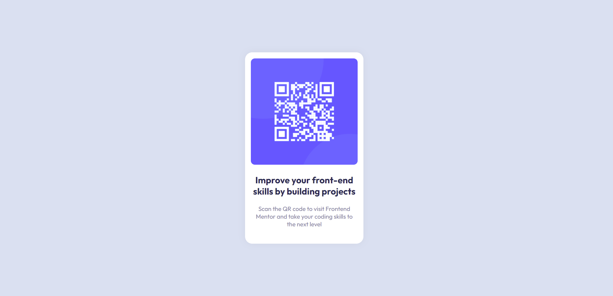

# Frontend Mentor - QR code component solution

This is a solution to the [QR code component challenge on Frontend Mentor](https://www.frontendmentor.io/challenges/qr-code-component-iux_sIO_H).

## Table of contents

- [Overview](#overview)
  - [Screenshot](#screenshot)
  - [Links](#links)
- [My process](#my-process)
  - [Built with](#built-with)
  - [What I learned](#what-i-learned)
- [Author](#author)

## Overview

### Screenshot

### Links

- Solution URL: [Add solution URL here](https://github.com/maciejfedor/frontendmentor.io/tree/master/qr-code-component-main)
- Live Site URL: [Add live site URL here](https://qr-code-component-maciej.netlify.app/)

## My process

### Built with

- HTML5
- CSS3
- Flexbox

### What I learned

Gained more confidence in centering elements using Flexbox

## Author

- Frontend Mentor - [@maciejfedor](https://www.frontendmentor.io/profile/maciejfedor)
