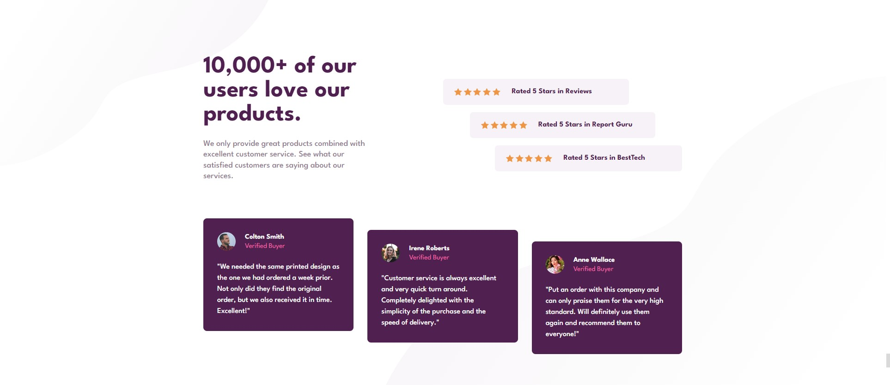

# Frontend Mentor - Social proof section solution

This is a solution to the [Social proof section challenge on Frontend Mentor](https://www.frontendmentor.io/challenges/social-proof-section-6e0qTv_bA).

## Table of contents

- [Overview](#overview)
  - [The challenge](#the-challenge)
  - [Screenshot](#screenshot)
  - [Links](#links)
- [My process](#my-process)
  - [Built with](#built-with)
  - [What I learned](#what-i-learned)
  - [Author](#author)

## Overview

### The challenge

Users should be able to:

- View the optimal layout depending on their device's screen size

### Screenshot

### Links

- [Solution](https://github.com/maciejfedor/frontendmentor.io/tree/master/social-proof-section-master)
- [Live site](https://social-proof-section-maciej.netlify.app/)

## My process

### Built with

- HTML5
- CSS Grid
- Flexbox

### What I learned

- Working with svgs as background images
- gained more experience in both flexbox an css grid

## Author

- Frontend Mentor - [@maciejfedor](https://www.frontendmentor.io/profile/maciejfedor)
